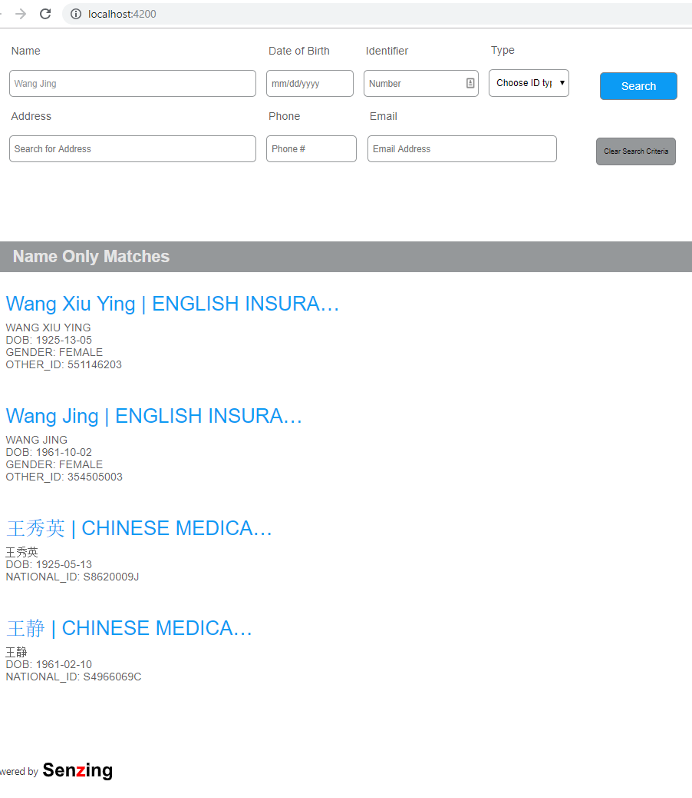

# Example Angular App using @senzing/sdk-components-web


## Overview
This is an example web app using web components from the @senzing/sdk-components-web package. It is meant to serve as a living document illustrating the steps necessary to get up and running with the web components connecting to a G2 project datasource through the [Senzing API Server](https://github.com/Senzing/senzing-api-server).

You can check out this repo, do an `npm install`, then skip ahead to the 
[Start up Server(s) section](#Start-up-Servers). Or you can follow along with the steps below to create your own, and if you run in to any problems you can refer back to this code.

### Web Components
Web components are a set of web platform APIs that allow you to create new custom, reusable, encapsulated HTML tags to use in web pages and web apps. Custom components and widgets build on the Web Component standards, will work across modern browsers, and can be used with any JavaScript library or framework that works with HTML.

For more information on the subject see the following sites:
* [WebComponents.org](https://www.webcomponents.org/introduction)
* [Web Components | MDN](https://developer.mozilla.org/en-US/docs/Web/Web_Components)
* [Building Components | Web Fundamentals | Google Developers](https://developers.google.com/web/fundamentals/web-components/)

<br/><br/>

## Steps:
  - [Prerequisites](#install-nodejs)
  - [Create a new App](#create-web-app)
  - [Start up Servers](#Start-up-Servers)
    - [API Server](#api-server)
    - [APP Server](#app-server)
  - [Create index.html](#Create-indexhtml)
    - [Copy example.html](#Copy-Example)
    - [Create index.html](#From-Scratch)
      - [Add SzSearch, SzSearchResults, and SzEntityDetail Tags](#Add-the-components)
      - [Wire them together](#Wire-them-together)
  - [Finishing Up](#Full-Circle)
<br/><br/>

### Install NodeJS
If you haven't already done so, install NodeJS. If you already have node installed, great! lets just check the version `node -v` and check that we're good to go:


If not, either update node [via the cmdline](https://www.youtube.com/watch?v=C9gehlXhS6U) or just go through the steps as if you were installing it from scratch below.

Go grab the binary for the apropriate platform from https://nodejs.org/ and come back here once done.

<a hfre="https://nodejs.org/"></a>
<br/><br/>

### Create Web App
This is just a directory to hold our npm configuration really. It just makes it easier for this walkthrough going forward to have everything in a neat little box.

```
mkdir sdk-components-example-web-app
cd sdk-components-example-web-app
npm init -y
npm install http-server
```

### Start up Servers
Start up the [Senzing API Server](https://github.com/Senzing/senzing-api-server). If you don't already have an instance of the rest server accessible to you over the network or on your local machine one you will have to set one up. 

For this example I've got the api server started using the default hostname and port(http://localhost:2208) and using the same G2.ini that my [Senzing Desktop App](https://senzing.com/senzing-app) install is using. (see default locations below)
<table>
    <thead>
        <tr><td>platform</td><td>default</td></tr>
    </thead>
    <tbody>
        <tr><td>Windows</td><td>%LOCALAPPDATA%\Senzing\Workbench\project_1\g2.ini</td></tr>
        <tr><td>Mac</td><td>~/Library/Application Support/com.senzing.workbench/workbench/project_1/g2.ini
</td></tr>
        <tr><td>Linux</td><td>/opt/senzing/g2/python/G2Module.ini</td></tr>
        <tr><td>Docker</td><td>[ TODO ]</td></tr>
    </tbody>
</table>

Those are just the default locations, depending on how the install was set up to operate it could be anywhere the administrator specified it to be. _When in doubt, ask about_

For more in depth information on G2Config Options and setup see [Senzing API [for Developers]
](https://senzing.zendesk.com/hc/en-us/categories/360000120514-Senzing-API-for-Developers-) or http://docs.senzing.com/1.4/#g2config 

#### API Server

```terminal
java -jar "%HOMEPATH%\www\rest-api-server-java\target\sz-api-server-1.5.0.jar" -iniFile "%LOCALAPPDATA%\Senzing\Workbench\project_1\g2.ini"
```

the result should be something like:


#### APP Server
Add the following to your package.json files scripts section:
```json
  "scripts": {
    "start": "http-server --cors -a localhost -p 4200 -o"
  },
```

now start the server up with `npm start`. A browser window should automatically open to http://localhost:4200/ 

For the time being it should just show a directory listing until we add some content in the next step.


## Create index.html
There are two ways to do this. We can start from scratch and I can walk you through the steps and how and why of each one.

<h3 name="Copy-Example">Or...</h3>
You can just copy the example.html from the node package to your web app root. If you want to go this route just do a 
`cp node_modules/@senzing/sdk-components-web/example.html index.html` update the css and javascript links to point to the location in node_modules, and skip ahead to the [Servers](#Servers) Step.
```
<link rel="stylesheet" href="node_modules/@senzing/sdk-components-web/senzing-components-web.css">...

<script type="text/javascript" src="node_modules/@senzing/sdk-components-web/senzing-components-web.js"></script>...
```


### From Scratch
Run `touch index.html`. Then open up the html file in your preferred IDE. Add the basic html boilerplate like the following:
```html
<!DOCTYPE html><html lang="en">
    <head>
        <title>Web Components Rule !!</title>
    </head>
    <body>
        
    </body>
</html>
```

Then add the component styles and javascript from the npm package to our document:
```html
...
    <link rel="stylesheet" href="node_modules/@senzing/sdk-components-web/senzing-components-web.css">
</head>
```

Then at the end of the body add the javascript module:
```html

    <script type="text/javascript" src="node_modules/@senzing/sdk-components-web/senzing-components-web.js"></script>
</body>
```

### Add the components
We're going to add a [SzSearchComponent](https://senzing.github.io/sdk-components-ng/components/SzSearchComponent.html), [SzSearchResultsComponent](https://senzing.github.io/sdk-components-ng/components/SzSearchResultsComponent.html), and a [SzEntityDetailComponent](https://senzing.github.io/sdk-components-ng/components/SzEntityDetailComponent.html).
The Search box to give us a search input interface, the results list(to display the results), and finally a detail view component(to give us a little more detail about the entity).

Add the following tags to the body of your document( but above the library reference)
```html
  <sz-search></sz-search>
  <h2 id="no-results">No Results Found</h2>
  <sz-search-results class="hidden"></sz-search-results>
  <sz-entity-detail class="hidden"></sz-entity-detail>
```

We want the search results, and detail views to be hidden unless there is content to be displayed in each so lets add that *hidden* class to the document.
```css
  <style>
    body {
      font-family: 'Segoe UI', Tahoma, Geneva, Verdana, sans-serif;
      color: rgb(46, 46, 46);
    }
    .no-results, .hidden {
      display: none !important;
    }
  </style>
```

So now if we reload http://localhost:4200, we'll have just one thing on the page. The search box. If you fill in some criteria and click search nothing happens, what gives?

Stuff is happening, if you open up the developer tools and go to the network tab you'll see XHR requests being made to the API Server and responses being returned. 

### Wire them together

Add a new script block to the head of the document with a function that gets called on window load. Inside of that, lets get dom references to our sdk component tags like so:
```html
<script>
    // wire up senzing web components to event handlers
    window.onload = function() {
      var searchBoxEle    = document.querySelector('sz-search');
    }
</script>
```


Each Component has a number of events it publishes and input attributes that can be used to interact with it. Lets add a listener to the document for the *sz-search* tag's *resultChange* event.

```javascript
    window.onload = function() {
      var searchBoxEle    = document.querySelector('sz-search');

      searchBoxEle.addEventListener('resultsChange', function(evt) {
        if(evt.detail){
            console.log('We Got Results! ',evt.detail);
        }
      }
    }
```
Now if we refresh the page and perform a search we'll see our console.log statement in the developer console when search is clicked.

So we could iterate over the results from the api response and write out a bunch of dom list elements to show the results. We _could_, but no. That's what the *sz-search-results* element is for. Add the following to our script block:

```javascript
    window.onload = function() {
      var searchBoxEle    = document.querySelector('sz-search');
      var searchResEle    = document.querySelector('sz-search-results');

      searchBoxEle.addEventListener('resultsChange', function(evt) {
        if(evt.detail){
            // has payload
            var searchResults = evt.detail;
            // take our results and feed it in to the results list
            searchResEle.setAttribute('results', JSON.stringify(searchResults));
            // remove the "hidden" class from results
            searchResEle.removeAttribute('class');
        }
      }
    }
```
So now if we refresh the page and search again, the same results we were printing out to the console log will be displayed visually like below:



That's pretty basic. It was easy though right? We should add a detail view that only displays when an individual result is clicked on.

Add variables for the detail tag, the message to display when no results are found, and a event listener for a user clears the form. Lets also add two functions, one for showing whether or not the detail view is active, and one for delegating the class names applied for each tag we want to toggle display for:

```javascript
    // wire up senzing web components to event handlers
    window.onload = function() {
      var searchBoxEle    = document.querySelector('sz-search');
      var searchResEle    = document.querySelector('sz-search-results');
      var entityDetailEle = document.querySelector('sz-entity-detail');
      var noResultsEle    = document.querySelector('#no-results');

      // show or hide the detail view
      function showDetailView(entityId) {
        entityDetailEle.setAttribute('entity-id', entityId);
        searchResEle.setAttribute('class','hidden');
        entityDetailEle.removeAttribute('class');
        applyClassesByState();
      }

      // depending on whether or not there are results
      // display results list or detail view or none
      function applyClassesByState(searchResults) {
        // first check if there are results to display
        if(searchResults && searchResults.length <= 0){
            noResultsEle.removeAttribute('class');
            searchResEle.setAttribute('class','hidden');
            entityDetailEle.setAttribute('class','hidden');
        } else {
            noResultsEle.setAttribute('class','hidden');
            searchResEle.removeAttribute('class');
            entityDetailEle.setAttribute('class','hidden');
        }

        // is there a entity id being displayed in the detail view?
        var currentlySelectedEntity = entityDetailEle.getAttribute("entity-id");
        if(currentlySelectedEntity){ parseInt(currentlySelectedEntity); }
        if( currentlySelectedEntity > 0){
            // hide results list
            searchResEle.setAttribute('class','hidden');
            // show detail
            entityDetailEle.removeAttribute('class');
        }
      }
      
      searchBoxEle.addEventListener('resultsChange', function(evt) {
        if(evt.detail){
          // has payload
          var searchResults = evt.detail;          
          searchResEle.setAttribute('results', JSON.stringify(searchResults));
          applyClassesByState(searchResults);
        }
      });
      searchResEle.addEventListener('resultClick', function(evt){
        if(evt.detail && evt.detail.entityId){
          showDetailView(evt.detail.entityId);
        }
      });
      searchBoxEle.addEventListener('resultsCleared', function(evt) {      
        var searchResults = evt.detail;          
        searchResEle.setAttribute('results', JSON.stringify(searchResults));
        showDetailView(false);
        applyClassesByState(searchResults);
      });
      
    };
```
### Full Circle

Now we can go from a search form, to displaying the results, to displaying an individual detail view, and back to just the search form by clicking the clear button. 
